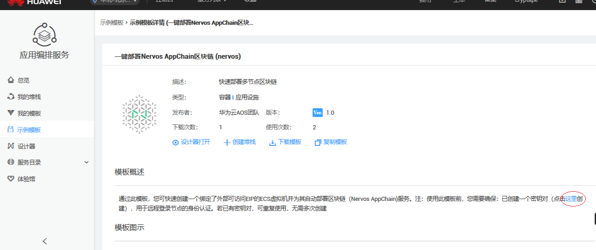

# 部署一条 AppChain

在开始正式开发AppChain DApp之前，我们需要先有一条AppChain。可以从以下方案中进行选择：

* [测试链](#测试链)
* [使用华为云一键云部署](#华为云一键部署操作指南)
* [使用万云BaaS服务](#万云操作指引)
* 自己部署一条

# 测试链

如果你是普通的开发者，我们推荐使用已经部署好的测试链Nervos AppChain Testnet，链信息如下：

`121.196.200.225:1337`

链上EVM版本为`0.4.19`，可以向下兼容低版本的合约。近期我们也会很快会升级到最新版本的Solidity编译器。

区块链浏览器部署在：

http://47.96.231.19/ 打开浏览器后需要切换对应的AppChain服务，点开右上角链信息按钮，找到“其他链”输入框，输入测试链的PRC地址切换。

领币的水龙头在：

http://47.96.231.19:9999/ 打开后输入自己的钱包地址，即可领到测试链上的原生代币NOS。可以使用它来部署和调用合约。

# 华为云一键部署操作指南

**操作目的**

目前一键部署的功能为，通过使用部署模板，用户只需输入必要的配置参数，即可一键部署一条至少4个节点的chain。

**操作前提**

用户已经在华为云官网注册。并且已经账户充入一定的资金。

**关于密钥对**

若用户之前没有创建过密钥对，则应先在“示例模板>示例模板详情”的“模板概述”中按提示创建一个密钥对。

若已经有密钥对，则进入示例模板详情页面，然后“创建堆栈”，按页面提示一步步输入配置信息并最终创建堆栈。

**具体步骤为**

1. 官网点击链接：

https://console.huaweicloud.com/

选择示例模板功能，搜索Nervos模板，并选择。

2. 点击“创建堆栈”，

其中，token_avatar为代币图标，应输入图标所在的url链接。

3. 点击下一步，

 输入资源配置的相关参数。如下图：

一个用户用同一个模板在一个区域（见下图第一个参数“集群可用区”）只能部署一个链。

另外,第一次操作时用户没有sshkey，需要先生成sshkey.

Cce_node_flavor为节点的规格，指CPU和内存规格。如4核8G，8核16G，16核32G。

Cita_sfs_size为节点的硬盘大小。

Eip_bandwidth为节点的带宽。

您可根据您的具体要求输入配置。也可以参考我们的推荐配置来输入：

| 参考性能（TPS） | 云主机个数 | 节点个数 | CPU和内存 | 每台带宽(Mbps) |
| --------- | ----- | ---- | ------ | ---------- |
| 1500      | 4     | 4    | 4核8G   | 10         |
| 3900      | 4     | 4    | 8核16G  | 20         |
| 15000     | 4     | 4    | 32核64G | 100        |

 点击“下一步”。显示，

 点击创建堆栈，页面显示创建进度，最后完成。

生成sshkey的步骤为,返回到第一个页面，如下图，找到“这里”，并点击

 点击后显示：

 点击“创建密钥对”，

 点击“确定”。

 密钥文件下载到本地。

# 万云操作指引

1. 打开万云主页：https://www.wancloud.io/

并登陆（没有注册的用户需要先注册再登陆）。

2. 在“极速万云”下拉菜单中，直接找到“Nervos AppChain” （或者，可以先点击“极速万云”，然后点击“公链”，然后找到Nervos AppChain）

3. 点击上一步中的“Nervos AppChain”，页面显示Nervos Appchain的介绍页面，如下：

其中接入地址即链的访问地址：http://nervosappchain-api.wancloud.io/， 端口号为默认值80

接口调用举例说明：

（查询有几个节点：）

`$ curl -X POST --data '{"jsonrpc":"2.0","method":"net_peerCount","params":[],"id":74}' http://nervosappchain-api.wancloud.io/`

其他命令请查看相关API文档 https://cryptape.github.io/cita/zh/usage-guide/rpc/

4. 点击“本地搭建”或“相关文档”，页面显示相关文档，及组件的链接（即将上线）

